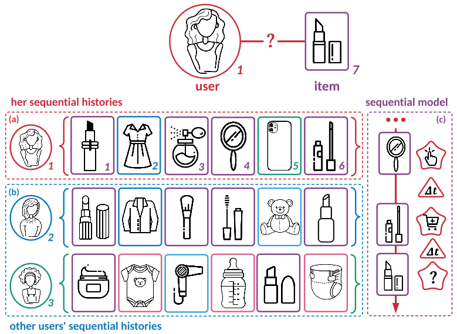

# Search-based Time-Aware Recommendation (STARec)

<p align="center">
  
  <br/>
  <br/>
</p>

This includes `tensorflow` and `pytorch` implementations of STARec model. This is the experiment code in the following work:


> Learn over Past, Evolve for Future: Search-based Time-aware Recommendation with Sequential Behavior Data </br>
Jiarui Jin, Xianyu Chen, Weinan Zhang, Junjie Huang, Ziming Feng, Yong Yu. </br>
[WWW 2022](https://arxiv.org/pdf/2202.03097.pdf)

### References
If you find this work helpful in your research, please consider citing the following paper. The bibtex are listed below:
```bibtex
@inproceedings{jin2022learn,
  title={Learn over Past, Evolve for Future: Search-based Time-aware Recommendation with Sequential Behavior Data},
  author={Jin, Jiarui and Chen, Xianyu and Zhang, Weinan and Huang, Junjie and Feng, Ziming and Yu, Yong},
  booktitle={WWW},
  year={2022}
}
```
